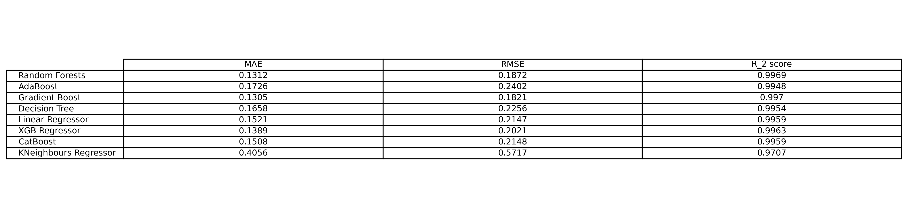
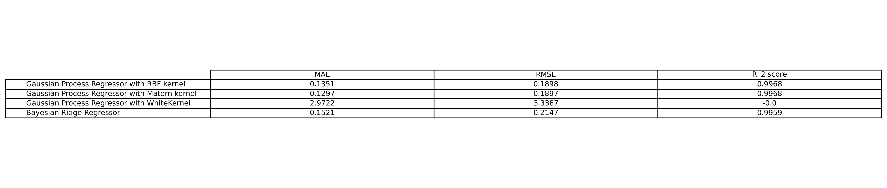

# pantheonplus-regression

This project applies simple machine learning models - such as **Linear Regression**, **Polynomial Regression**, **Decision Trees** and **Random Forests** to predict the **apparent magnitude($m_B$)** of Type Ia supernovae from the observed parameters:

- Redshift ($z$)
- Stretch ($x_1$)
- Color ($c$)

This project uses publicly available supernova datasets - **Pantheon+** and **DES 5-YEar** supernova compilations. The instructions to download these datasets are given in **data** folder. Please cite the respective papers if using these datasets in a work.

## Motivation

Type Ia supernova are standardizable candles used to measure cosmic distances. Here, we train regression models to predict the corrected/standardized apparent magnitudes of Type Ia supernovae from the redshift, stretch and color of the supernovae.

## Installation Instructions

Open a terminal/command line in your desired folder and run these commands :

```
git clone https://github.com/sreerag03a/pantheonplus-regression.git
cd pantheonplus-regression
pip install -r requirements.txt

```

Now, to just get the flask app running, it is recommended to run project_stage.py

Run project_stage.py to download the data and train the models for use.

```
python project_stage.py
```

Then you can run app.py and access 127.0.0.1:5000 for a simple website that can predict type Ia supernova magnitudes from input.

**This web app has been deployed on AWS and can be accessed through [here](http://pantheonplus-regression-env.eba-92ywm24p.ap-south-1.elasticbeanstalk.com/)**

### Models

1. Random Forests Regressor
2. AdaBoost Regressor
3. Gradient Boost Regressor
4. Decision Tree Regressor
5. Linear Regression
6. XGB Regressor
7. CatBoost Regressor
8. K Neighbours Regressor

#### Models giving uncertainty estimates

1. Gaussian Process Regressor (with different kernel functions - RBF, Matern, WhiteKernel)
2. Bayesian Ridge Regressor

### Evaluation Metrics

1. Mean Absolute Error
2. Root Mean Squared Error
3. $R^2$ score

### Model Performance





## Project Structure

```text
pantheonplus-regression/
├── data/
│   └── README.md
├── notebooks/
│   ├── 0_pantheonplus_visualization.ipynb
│   ├── 1_model_baseline.ipynb
│   └── 2_model_advanced.ipynb
├── outputs/
│   └──models/
├── src/
│   ├── components
│   │   ├── handling
│   │   │   ├── exceptions.py
│   │   │   ├── logger.py
│   │   │   └── utils.py
│   │   └── model
│   │       ├── data_transformation.py
│   │       └── model_trainer.py
│   ├── notebooksrc
│   │   ├── preprocessing.py
│   │   └── regressors.py
│   └── pipeline
│       └── predict_pipeline.py
├── templates/
│   ├── home.html
│   └── index.html
└── README.md
```
